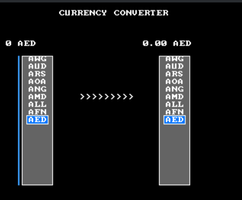

# Currency Converter

---

#### About

Currency Converter is a currency converter that can convert currencies from other countries to currencies from another country. Currency Converter uses [this api](developer.coingate.com).

---

#### Controls

The controls for Currency Converter are:

- 0-9 | enters numbers into input
- peroid | enters decimal form
- backspace | removes last number
- left or righ arrow keys | switches between first and second list of currencies
- up or down arrow keys | select currencies from list
- enter | calculates the currency value
